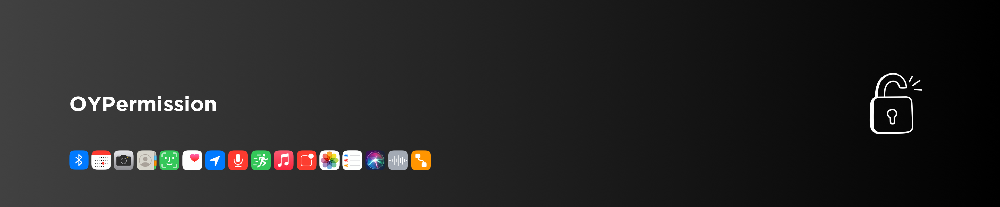

[](https://cocoapods.org/pods/OYPermission)
[](https://swift.org/package-manager/)
[](https://github.com/osmanyildirim/OYPermission)
[](https://swift.org)
[](https://developer.apple.com/xcode)
[](https://opensource.org/licenses/MIT)

<p align="left">
  
</p>

Swift SDK that user request permission for `Bluetooth`, `Calendar`, `Camera`, `Contacts`, `FaceId`, `Health`, `Location`, `Media Library`, `Microphone`, `Motion`, `Notification`, `Photo Library`, `Reminders`, `Siri`, `Speech Recognizer`, `Tracking`

> You need to add some keys to the `Info.plist` file with descriptions, per Apple's requirements. In the header of the permission type you can see the keys.

## Contents

- [Requirements](#requirements)
- [Installation](#installation)
- [Open Settings Page](#open-settings-page)
- [Types](#types)
  - [Bluetooth](#bluetooth)
  - [Calendar](#calendar)
  - [Camera](#camera)
  - [Contacts](#contacts)
  - [FaceID](#faceId)
  - [Health](#health)
  - [Location Always](#location-always)
  - [Location When In Use](#location-when-in-use)
  - [Media Library](#media-library)
  - [Microphone](#microphone)
  - [Motion](#motion)
  - [Notifications](#notifications)
  - [Photos](#photos)
  - [Reminders](#reminders)
  - [Siri](#siri)
  - [Speech Recognition](#speech-recognition)
  - [Tracking](#tracking)
- [Status Enum Type](#status-enum-type)
- [License](#license)

## Requirements

- iOS 11.0+
- Swift 5.0+

## Installation

<details>
<summary>CocoaPods</summary>
<br/>
<p>Add the following line to your <code>Podfile</code></p>

```
pod 'OYPermission'
```
</details>

<details>
<summary>Swift Package Manager</summary>
<br/>
<p>Add OYPermission as a dependency to your <code>Package.swift</code> and specify OYPermission as a target dependency</p>

```swift
import PackageDescription

let package = Package(
    name: "YOUR_PROJECT_NAME",
    targets: [],
    dependencies: [
        .package(url: "https://github.com/osmanyildirim/OYPermission", .upToNextMinor(from: "1.0")),
    ],
    targets: [
        .target(
            name: "YOUR_PROJECT_NAME",
            dependencies: ["OYPermission"])
    ]
)
```
</details>

## Open Settings Page

The settings page of the application can be opened as in the followings.

```swift
OYPermission.openSettings(.noPopup) {
    /// do stuff
}
```

```swift
OYPermission.openSettings(.withPopup(title: "Title", message: "Message")) {
    /// do stuff
}
```

## Types

### [Bluetooth](https://developer.apple.com/documentation/corebluetooth/cbperipheralmanager)

>  you need to add `NSBluetoothAlwaysUsageDescription` and `NSBluetoothPeripheralUsageDescription` keys and descriptions to Info.plist file for Bluetooth permission request

... request permission of Bluetooth ...

```swift
OYPermission.bluetooth.request { granted, error in
    /// do stuff
}
```

... permission status of Bluetooth, returns [Status](#status-enum-type) enum value ...

```swift
OYPermission.bluetooth.status
```

... keys that need to be defined in the Info.plist file for the Bluetooth permission request ...

```swift
OYPermission.bluetooth.descriptionKeys
```

### [Calendar](https://developer.apple.com/documentation/eventkit/ekeventstore)

>  you need to add `NSCalendarsUsageDescription` key and description to Info.plist file for Calendar permission request

... request permission of Calendar ...

```swift
OYPermission.calendar.request { granted, error in
    /// do stuff
}
```

... permission status of Calendar, returns [Status](#status-enum-type) enum value ...

```swift
OYPermission.calendar.status
```

... the key that needs to be defined in the Info.plist file for the Calendar permission request ...

```swift
OYPermission.calendar.descriptionKeys
```

### [Camera](https://developer.apple.com/documentation/avfoundation/avcapturedevice)

>  you need to add `NSCameraUsageDescription` key and description to Info.plist file for Camera permission request

... request permission of Camera ...

```swift
OYPermission.camera.request { granted, error in
    /// do stuff
}
```

... permission status of Camera, returns [Status](#status-enum-type) enum value ...

```swift
OYPermission.camera.status
```

... the key that needs to be defined in the Info.plist file for the Camera permission request ...

```swift
OYPermission.camera.descriptionKeys
```

### [Contacts](https://developer.apple.com/documentation/contacts/cncontactstore)

>  you need to add `NSContactsUsageDescription` key and description to Info.plist file for Contacts permission request

... request permission of Contacts ...

```swift
OYPermission.contacts.request { granted, error in
    /// do stuff
}
```

... permission status of Contacts, returns [Status](#status-enum-type) enum value ...

```swift
OYPermission.contacts.status
```

... the key that needs to be defined in the Info.plist file for the Contacts permission request ...

```swift
OYPermission.contacts.descriptionKeys
```

### [FaceID](https://developer.apple.com/documentation/localauthentication/lacontext)

>  you need to add `NSFaceIDUsageDescription` key and description to Info.plist file for FaceID permission request

... request permission of FaceID ...

```swift
OYPermission.faceID.request { granted, error in
    /// do stuff
}
```

... permission status of FaceID, returns [Status](#status-enum-type) enum value ...

```swift
OYPermission.faceID.status
```

... the key that needs to be defined in the Info.plist file for the FaceID permission request ...

```swift
OYPermission.faceID.descriptionKeys
```

### [Health](https://developer.apple.com/documentation/healthkit/hkhealthstore)

>  you need to add `NSHealthUpdateUsageDescription` and `NSHealthShareUsageDescription` keys and descriptions to Info.plist file for Health permission request

... request permission of Health ...

```swift
let shareTypes: Set<HKSampleType> = [.workoutType()]
let readTypes: Set<HKSampleType> = [.workoutType()]

OYPermission.health.request(shareTypes: shareTypes, readTypes: readTypes) { granted, error in
    /// do stuff
}
```

... permission status of Health with `HKObjectType`, returns [Status](#status-enum-type) enum value ...

```swift
OYPermission.health.status(for: .activitySummaryType())
```

```swift
OYPermission.health.status(for: .workoutType())
```

... keys that need to be defined in the Info.plist file for the Health permission request ...

```swift
OYPermission.health.descriptionKeys
```

### [Location Always](https://developer.apple.com/documentation/corelocation/cllocationmanager)

>  you need to add `NSLocationAlwaysAndWhenInUseUsageDescription` and `NSLocationWhenInUseUsageDescription` keys and descriptions to Info.plist file for LocationAlways permission request

... request permission of LocationAlways ...

```swift
OYPermission.location(.always).request { granted, error in
    /// do stuff
}
```

... permission status of LocationAlways, returns [Status](#status-enum-type) enum value ...

```swift
OYPermission.location(.always).status
```

... keys that need to be defined in the Info.plist file for the LocationAlways permission request ...

```swift
OYPermission.location(.always).descriptionKeys
```
<br/>

> :balloon: **Tip:**
>
> **`locationStatus`** gives status for both *`LocationAlways`* and *`LocationWhenInUse`*. Can be used together or separately for LocationAlways and LocationWhenInUse.
>
> **locationStatus** returns `.notDetermined`, .`authorizedAlways`, `.authorizedWhenInUse` and `.denied`
> 
> ```swift
> OYPermission.locationStatus
> ```

### [Location When In Use](https://developer.apple.com/documentation/corelocation/cllocationmanager)

>  you need to add `NSLocationAlwaysAndWhenInUseUsageDescription` key and description to Info.plist file for LocationWhenInUse permission request

... request permission of LocationWhenInUse ...

```swift
OYPermission.location(.whenInUse).request { granted, error in
    /// do stuff
}
```

... permission status of LocationWhenInUse, returns [Status](#status-enum-type) enum value ...

```swift
OYPermission.location(.whenInUse).status
```

... keys that need to be defined in the Info.plist file for the LocationWhenInUse permission request ...

```swift
OYPermission.location(.whenInUse).descriptionKeys
```
<br/>

> :balloon: **Tip:**
>
> **`locationStatus`** gives status for both *`LocationAlways`* and *`LocationWhenInUse`*. Can be used together or separately for LocationAlways and LocationWhenInUse.
>
> **locationStatus** returns `.notDetermined`, .`authorizedAlways`, `.authorizedWhenInUse` and `.denied`
> 
> ```swift
> OYPermission.locationStatus
> ```

### [Media Library](https://developer.apple.com/documentation/mediaplayer/mpmedialibrary)

>  you need to add `NSAppleMusicUsageDescription` key and description to Info.plist file for Media Library permission request

... request permission of Media Library ...

```swift
OYPermission.mediaLibrary.request { granted, error in
    /// do stuff
}
```

... permission status of Media Library, returns [Status](#status-enum-type) enum value ...

```swift
OYPermission.mediaLibrary.status
```

... the key that needs to be defined in the Info.plist file for the Media Library permission request ...

```swift
OYPermission.mediaLibrary.descriptionKeys
```

### [Microphone](https://developer.apple.com/documentation/avfaudio/avaudiosession)

>  you need to add `NSMicrophoneUsageDescription` key and description to Info.plist file for Microphone permission request

... request permission of Microphone ...

```swift
OYPermission.microphone.request { granted, error in
    /// do stuff
}
```

... permission status of Microphone, returns [Status](#status-enum-type) enum value ...

```swift
OYPermission.microphone.status
```

... the key that needs to be defined in the Info.plist file for the Microphone permission request ...

```swift
OYPermission.microphone.descriptionKeys
```

### [Motion](https://developer.apple.com/documentation/coremotion/cmmotionmanager)

>  you need to add `NSMotionUsageDescription` key and description to Info.plist file for Motion permission request

... request permission of Motion ...

```swift
OYPermission.motion.request { activities, error in
    /// do stuff
}
```

... permission status of Motion, returns [Status](#status-enum-type) enum value ...

```swift
OYPermission.motion.status
```

... the key that needs to be defined in the Info.plist file for the Motion permission request ...

```swift
OYPermission.motion.descriptionKeys
```

### [Notifications](https://developer.apple.com/documentation/usernotifications/unusernotificationcenter)

>  you need to add `NSUserNotificationsUsageDescription` key and description to Info.plist file for Notifications permission request

... request permission of Notifications ...

```swift
OYPermission.notifications.request { granted, error in
    /// do stuff
}
```

... permission status of Notifications, returns [Status](#status-enum-type) enum value ...

```swift
OYPermission.notifications.status
```

... the key that needs to be defined in the Info.plist file for the Notifications permission request ...

```swift
OYPermission.notifications.descriptionKeys
```

### [Photos](https://developer.apple.com/documentation/photokit/phphotolibrary)

>  you need to add `NSPhotoLibraryUsageDescription` and `NSPhotoLibraryAddUsageDescription` keys and descriptions to Info.plist file for Photos permission request

... request permission of Photos ...

```swift
OYPermission.photos.request { granted, error in
    /// do stuff
}
```

... permission status of Photos, returns [Status](#status-enum-type) enum value ...

```swift
OYPermission.photos.status
```

... keys that need to be defined in the Info.plist file for the Photos permission request ...

```swift
OYPermission.photos.descriptionKeys
```

### [Reminders](https://developer.apple.com/documentation/eventkit/ekeventstore)

>  you need to add `NSRemindersUsageDescription` key and description to Info.plist file for Reminders permission request

... request permission of Reminders ...

```swift
OYPermission.reminders.request { granted, error in
    /// do stuff
}
```

... permission status of Reminders, returns [Status](#status-enum-type) enum value ...

```swift
OYPermission.reminders.status
```

... the key that needs to be defined in the Info.plist file for the Reminders permission request ...

```swift
OYPermission.reminders.descriptionKeys
```

### [Siri](https://developer.apple.com/documentation/sirikit/inpreferences)

>  you need to add `NSSiriUsageDescription` key and description to Info.plist file for Siri permission request

... request permission of Siri ...

```swift
OYPermission.siri.request { granted, error in
    /// do stuff
}
```

... permission status of Siri, returns [Status](#status-enum-type) enum value ...

```swift
OYPermission.siri.status
```

... the key that needs to be defined in the Info.plist file for the Siri permission request ...

```swift
OYPermission.siri.descriptionKeys
```

### [Speech Recognition](https://developer.apple.com/documentation/speech/sfspeechrecognizer)

>  you need to add `NSSpeechRecognitionUsageDescription` key and description to Info.plist file for Speech Recognition permission request

... request permission of Speech Recognition ...

```swift
OYPermission.speechRecognition.request { granted, error in
    /// do stuff
}
```

... permission status of Speech Recognition, returns [Status](#status-enum-type) enum value ...

```swift
OYPermission.speechRecognition.status
```

... the key that needs to be defined in the Info.plist file for the Speech Recognition permission request ...

```swift
OYPermission.speechRecognition.descriptionKeys
```

### [Tracking](https://developer.apple.com/documentation/apptrackingtransparency/attrackingmanager)

>  you need to add `NSUserTrackingUsageDescription` key and description to Info.plist file for Tracking permission request

... request permission of Tracking ...

```swift
OYPermission.tracking.request { granted, error in
    /// do stuff
}
```

... permission status of Tracking, returns [Status](#status-enum-type) enum value ...

```swift
OYPermission.tracking.status
```

... the key that needs to be defined in the Info.plist file for the Tracking permission request ...

```swift
OYPermission.tracking.descriptionKeys
```

## Status Enum Type

```swift
enum Status {
    /// User grants access
    case authorized

    /// User grants access to location when in use
    case authorizedWhenInUse

    /// User grants access to location always
    case authorizedAlways

    /// User denies access
    case denied

    /// User has not been asked for access yet
    case notDetermined

    /// Unsupported this permission
    case notSupported

    /// Access is restricted by the system
    case restrictedBySystem

    /// Unknown status of permission
    case unknown
}
```

## License
OYPermission is released under an MIT license. [See LICENSE](https://github.com/osmanyildirim/OYPermission/blob/main/LICENSE) for details.
